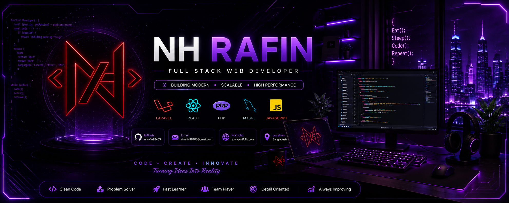

<!-- ================= BANNER ================= -->
<!-- Option A: animated gradient banner (no image upload needed) -->

  

<!-- Option B: your own cyberpunk banner image (uncomment after uploading it to /assets in your repo) -->
<!--

  

-->

<!-- ================= TECH STACK ================= -->

  
  
  
  
  
  
  
  

<!-- ================= SOCIAL BUTTONS + PROFILE VIEWS ================= -->

  
  
  
  
  

 

<!-- ================= ABOUT ME ================= -->
## 🧑‍💻 About Me

<table>
<tr>
<td width="58%" valign="top">

- 🔭 I'm currently working on something cool 😎
- 🌱 I'm currently learning something amazing 🔥
- 📁 All of my projects are available at&nbsp;
  <a href="https://morshidul-portfolio.netlify.app">morshidul-portfolio.netlify.app</a>
- 💬 Ask me about **React, JavaScript, Node.js, Next.js, MongoDB**
- 📫 How to reach me: **morshidulrahman4167@gmail.com**
- 📄 Know about my experiences: <a href="#">Resume</a>
- ⚡ Fun fact: I think I'm crazy

</td>
<td width="42%" align="center">
  
</td>
</tr>
</table>

### Connect with me:

  
  
  
  

<!-- ================= OPTIONAL BONUS: GITHUB STATS ================= -->

  
  

<!-- ================= BANNER ================= -->
<!-- Option A: animated gradient banner (no image upload needed) -->

  

<!-- Option B: your own cyberpunk banner image (uncomment after uploading it to /assets in your repo) -->
<!--

  

-->

<!-- ================= TECH STACK ================= -->

  
  
  
  
  
  
  
  

<!-- ================= SOCIAL BUTTONS + PROFILE VIEWS ================= -->

  
  
  
  
  

 

<!-- ================= ABOUT ME ================= -->
## 🧑‍💻 About Me

<table>
<tr>
<td width="58%" valign="top">

- 🔭 I'm currently working on something cool 😎
- 🌱 I'm currently learning something amazing 🔥
- 📁 All of my projects are available at&nbsp;
  <a href="https://morshidul-portfolio.netlify.app">morshidul-portfolio.netlify.app</a>
- 💬 Ask me about **React, JavaScript, Node.js, Next.js, MongoDB**
- 📫 How to reach me: **morshidulrahman4167@gmail.com**
- 📄 Know about my experiences: <a href="#">Resume</a>
- ⚡ Fun fact: I think I'm crazy

</td>
<td width="42%" align="center">
  
</td>
</tr>
</table>

### Connect with me:

  
  
  
  

 

---

<!-- ================= GITHUB STATS ================= -->
## 📊 GitHub Stats

  
  

  

<!-- ================= TROPHIES ================= -->

  

<!-- ================= CONTRIBUTION SNAKE ================= -->

  

<!--
  Snake setup (one-time):
  1) Repo Settings → Secrets → add a personal access token if needed
  2) Add this GitHub Action: https://github.com/Platane/snk
  It auto-generates the animated snake above from your contribution graph.
-->

 

---

<!-- ================= FEATURED PROJECTS ================= -->
## 🚀 Featured Projects

<table>
<tr>
<td width="50%">

### 🔹 [Project One](#)
Short one-line description of what it does and the problem it solves.
 
`React` `Node.js` `MongoDB`

</td>
<td width="50%">

### 🔹 [Project Two](#)
Short one-line description of what it does and the problem it solves.
 
`Laravel` `MySQL` `jQuery`

</td>
</tr>
<tr>
<td width="50%">

### 🔹 [Project Three](#)
Short one-line description of what it does and the problem it solves.
 
`JavaScript` `PHP` `CSS`

</td>
<td width="50%">

### 🔹 [Project Four](#)
Short one-line description of what it does and the problem it solves.
 
`Next.js` `Tailwind` `MongoDB`

</td>
</tr>
</table>

<i>See all projects on my <a href="https://morshidul-portfolio.netlify.app">portfolio</a> →</i>

 

---

<!-- ================= SUPPORT ================= -->
## ☕ Support Me

  

<!-- ================= FOOTER ================= -->

  

<i>Thanks for visiting my profile — feel free to connect! 🚀</i>

