 

👨‍💻 About Me

yamlName:      NH Rafin
Role:      Full Stack Web Developer
Location:  Bangladesh 🇧🇩
Focus:     Laravel · React · PHP
Learning:  Advanced React, Advanced Laravel, Node.js
Open To:   Internship · Freelance · Collaboration

I build clean, modern full-stack web applications — with a strong focus on Laravel on the backend and React on the frontend.

🛠 Tech Stack

🚀 Featured Projects

<table align="center">
<tr>
<td width="50%">

</td>
<td width="50%">

</td>
</tr>
</table>
🌐 Portfolio Website — React · Vite · Tailwind CSS · Dark/Light theme · Contact form

🚚 Courier Management System — Laravel · MySQL · Auth · Parcel Tracking · Admin Dashboard

📊 GitHub Stats

📅 Roadmap

✅ HTML ✅ CSS ✅ JS ✅ PHP ✅ Laravel ✅ MySQL ✅ Git/GitHub — done
🟡 React 🟡 REST API 🟡 Node.js — in progress
🔜 Docker 🔜 TypeScript 🔜 Next.js 🔜 Cloud Deployment — up next

💜 "Success doesn't come from what you know. It comes from what you build consistently."

